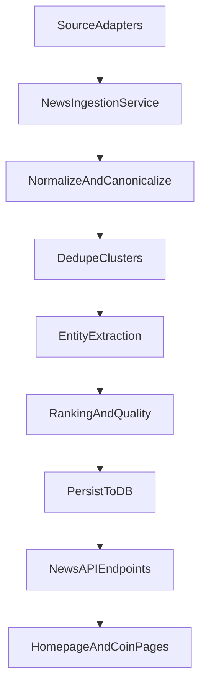

# Block70 News Engine

Production-oriented crypto news ingestion and ranking pipeline used by homepage trending news and coin-specific news views.

## Architecture

## Source Adapters

- `coindeskApiAdapter`
- `coindeskRssAdapter`
- `cointelegraphRssAdapter`
- `decryptRssAdapter`
- `blockworksScrapeAdapter`

Each adapter:
- fetches independently with retries/timeouts
- returns normalized `SourceArticle` candidates
- includes raw payload metadata for debugging
- can fail without breaking global ingestion

## Data Model

Primary tables:
- `news_articles`: canonical stories and ranking metadata
- `news_clusters`: dedupe cluster state
- `news_raw_events`: raw fetch payloads + request metadata
- `news_entities`: extracted entities for analytics and query support

## Caching & Reliability

- Per-source fetch cache with TTL to avoid hammering upstream sources.
- Ingestion runs in parallel and isolates source failures.
- Structured logging includes source duration, fetch counts, and errors.

## Ranking

Homepage score formula:
- `0.25 * Recency + 0.15 * Relevance + 0.20 * Authority + 0.20 * CrossSource + 0.20 * Engagement`

Coin page score formula:
- `0.30 * Recency + 0.40 * CoinRelevance + 0.10 * Authority + 0.10 * CrossSource + 0.10 * Engagement`

`rank_explanation` persists per-story score breakdowns.

## Add A New Source Safely

1. Implement a new adapter class in `adapters/` implementing `fetch_latest`.
2. Register adapter in `NewsIngestionService.adapters`.
3. Add source authority score in `ranking.py`.
4. Add fixtures in `tests/news/fixtures`.
5. Add parsing tests in `tests/news/test_news_services.py`.
6. Validate ingestion logs and `/api/news/debug/:id` output.

## Local Runbook

- Trigger ingestion implicitly by calling:
  - `GET /api/news/trending`
  - `GET /api/news/latest`
- Inspect ranking/debug state:
  - `GET /api/news/debug/{id}`
