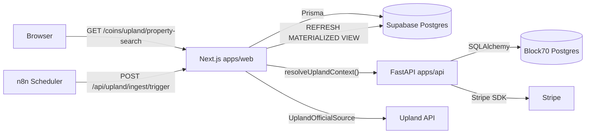

# Upland Property Search

Operator and developer reference for the Upland Property Search feature at
[`/coins/upland/property-search`](https://block70.com/coins/upland/property-search).

## Architecture

Two data planes:

1. **Main Block70 Postgres** (FastAPI `apps/api`, SQLAlchemy) owns auth, billing,
   entitlements, saved searches, API keys, portfolio watches, and daily usage
   rollups. Managed by the ad-hoc migration list in
   [`apps/api/app/db/migrations.py`](../apps/api/app/db/migrations.py).
2. **Supabase Postgres** (`apps/web`, Prisma) owns properties, assets, vehicles,
   ingestion runs, change events, and the search materialized views. Managed by
   Prisma (`apps/web/prisma/schema.prisma` + `prisma/migrations/`).



## Environment variables

### `apps/web`

| Variable | Required | Notes |
| --- | --- | --- |
| `DATABASE_URL` | yes | Supabase pooler URL (`pgbouncer=true`) |
| `DIRECT_URL` | yes | Direct Postgres URL for Prisma migrations |
| `REDIS_URL` | optional | Enables Redis cache + rate limits. In-memory fallback otherwise. |
| `BLOCK70_UPLAND_INGEST_SECRET` | yes in prod | Required on `X-Upland-Ingest-Secret` header for `/api/upland/ingest/*` and `/api/upland/deal-score/recompute`. |
| `UPLAND_INGEST_ENABLED` | yes in prod | Kill switch. Set to `1` to allow the `upland-official` source to run. |
| `UPLAND_SOURCE` | yes | `mock` or `upland-official`. Mock is default and safe. |
| `UPLAND_API_BASE_URL` | when `UPLAND_SOURCE=upland-official` | Base URL for the internal Upland API. Default `https://api.prod.upland.me`. |
| `UPLAND_API_TOKEN` | when `UPLAND_SOURCE=upland-official` | Bearer JWT captured from `play.upland.me`. Treat as a live credential -- rotate immediately if exposed. |
| `UPLAND_PROPERTY_IDS` | optional | Comma/whitespace-separated list of `prop_id`s to hydrate. Overridden per-request by the trigger body's `propIds`. |
| `UPLAND_APP_VERSION` | optional | `appversion` header the Upland edge expects. Default `0.14.1007`; bump if the web app is updated. |
| `UPLAND_RATE_LIMIT_MS` | optional | Sleep between detail calls. Default `500` (~2 req/s). |
| `UPLAND_PAGE_SIZE` | optional | Detail ids per ingestion page. Default `50`. |
| `BLOCK70_INTERNAL_API_URL` | optional | Internal URL for `apps/web` to reach FastAPI without egress. Falls back to `NEXT_PUBLIC_API_URL`. |
| `NEXT_PUBLIC_API_URL` | yes | Public FastAPI base URL. |

### `apps/api`

| Variable | Required | Notes |
| --- | --- | --- |
| `STRIPE_UPLAND_PRO_PRICE_ID` | yes in prod | Upland Pro recurring price. |
| `STRIPE_UPLAND_ELITE_PRICE_ID` | yes in prod | Upland Elite recurring price. |
| `STRIPE_SUCCESS_URL` | yes | Reused across global + Upland checkouts. |
| `STRIPE_CANCEL_URL` | yes | Reused across global + Upland checkouts. |
| `JWT_SECRET_KEY` | yes | Unchanged; `upland_tier` claim piggybacks on it. |

### n8n

Credentials referenced by the workflow at
[`docs/n8n-local-agents/workflows/block70-upland-property-sync.json`](n8n-local-agents/workflows/block70-upland-property-sync.json):

- `Upland Ingest Secret` (httpHeaderAuth) -- name `X-Upland-Ingest-Secret`, value
  matches `BLOCK70_UPLAND_INGEST_SECRET`.
- `Supabase Upland (pooler)` (postgres) -- used for the `REFRESH MATERIALIZED
  VIEW` node. Use a role that has `REFRESH` privilege, never the service role.

## Supabase setup

1. Create a new Supabase project (or a branch in an existing project) for the
   Upland data plane.
2. Copy the pooler URL (`DATABASE_URL`) and the direct URL (`DIRECT_URL`).
3. From `apps/web`:

   ```bash
   npx prisma migrate deploy
   npx prisma db seed         # loads mock data
   ```

4. Confirm the materialized views exist:

   ```sql
   SELECT count(*) FROM property_search_view;
   SELECT count(*) FROM city_stats_view;
   ```

## Running ingestion manually

### Mock data (always safe)

```bash
curl -X POST \
  -H "X-Upland-Ingest-Secret: $BLOCK70_UPLAND_INGEST_SECRET" \
  -H "Content-Type: application/json" \
  -d '{"source":"mock"}' \
  https://block70.com/api/upland/ingest/trigger
```

### Real Upland data (per-property detail)

The `upland-official` source hydrates properties one at a time by calling
`GET {UPLAND_API_BASE_URL}/api/properties/{prop_id}`. This is the same endpoint
the play.upland.me web app uses when a user clicks a parcel. It returns
everything Block70 needs: `full_address`, `city`, `state`, `price`, `status`,
`yield_per_hour`, `owner_username`, `building`, `centerlat`/`centerlng`, etc.

Prerequisites:

1. `UPLAND_INGEST_ENABLED=1`, `UPLAND_API_TOKEN=<fresh JWT>` set on the web app.
2. At least one prop_id to hydrate. Provide via either:
   - `UPLAND_PROPERTY_IDS` env var (persistent seed list), or
   - `propIds` field in the trigger body (overrides + extends the env list).

```bash
curl -X POST \
  -H "X-Upland-Ingest-Secret: $BLOCK70_UPLAND_INGEST_SECRET" \
  -H "Content-Type: application/json" \
  -d '{
        "source": "upland-official",
        "propIds": [
          "80257908844220",
          "80257908844221",
          "80257908844222"
        ]
      }' \
  https://block70.com/api/upland/ingest/trigger
```

Finding prop_ids today (bbox list endpoint is not yet wired):

1. Open https://play.upland.me, sign in, and pan to the area you want.
2. In DevTools -> Network, filter for `api.prod.upland.me`.
3. Click any parcel. The request to `/api/properties/<id>` is the detail call
   we're using. Copy the `<id>` values for every parcel you want.
4. Drop them into `propIds` or `UPLAND_PROPERTY_IDS`.

Status -> seller_type mapping:

| Upland `status` | `for_sale` | `seller_type` |
| --- | --- | --- |
| `For sale` | `true` | `player` (marketplace listing) |
| `Unlocked` | `true` | `mint` (buy from Upland) |
| `Owned` / `Locked` / other | `false` | `null` |

Security notes:

- `UPLAND_API_TOKEN` is a live credential. Never paste it into chat, git, or
  tickets. If it leaks, rotate it immediately by logging out of play.upland.me
  on the origin device.
- The source sends the same headers the Upland web client does (`appversion`,
  `origin`, `referer`, `locale`, `platform`). Overrides are available via
  `UPLAND_APP_VERSION`, `UPLAND_ORIGIN`, `UPLAND_REFERER`, `UPLAND_LOCALE`,
  `UPLAND_PLATFORM`, `UPLAND_USER_AGENT`.
- 401/403 from upland.me aborts the run (token rejected). 429/5xx backs off
  with 0ms / 750ms / 2500ms retries. Other 4xx fails fast.

Not yet implemented (follow-ups):

- **Bbox discovery.** Paste the URL + response body for the request Upland
  makes when you pan/zoom the map (the one that returns an array with
  `prop_id`, `boundaries`, `status`, `models`, ...). We'll add a
  `UPLAND_BBOX_LIST_PATH` driven discovery mode so operators don't need to
  collect ids by hand.
- **Developer API fallback.** The sanctioned
  [Developer API](https://docs.developers.upland.me/upland-developers/api-definitions/generic-endpoints)
  exposes `GET /properties?cityId=X` with basic auth. It doesn't return price
  or status, so it can't replace the detail source, but it's a candidate for
  bulk id discovery.

Status:

```bash
curl -H "X-Upland-Ingest-Secret: $BLOCK70_UPLAND_INGEST_SECRET" \
  https://block70.com/api/upland/ingest/status
```

Deal score recompute (after changing `DEAL_SCORE_WEIGHTS` or bumping the
version):

```bash
curl -X POST \
  -H "X-Upland-Ingest-Secret: $BLOCK70_UPLAND_INGEST_SECRET" \
  https://block70.com/api/upland/deal-score/recompute
```

## Kill switches

- `UPLAND_INGEST_ENABLED=false` -- web app returns 503 on ingest endpoints; n8n
  workflow retries backs off. No data mutations happen.
- Toggle the `block70-upland-property-sync` workflow `active=false` in n8n to
  pause scheduling without redeploying.
- In Stripe, disable the Upland price IDs to stop new checkouts without
  changing code. Existing subscriptions continue billing.

## Monetization setup

1. Stripe Dashboard: create a new product `Block70 Upland` with two recurring
   prices ($10 pro, $50 elite). Copy the price IDs into
   `STRIPE_UPLAND_PRO_PRICE_ID` / `STRIPE_UPLAND_ELITE_PRICE_ID`.
2. Webhooks: the existing `/api/v1/webhooks/stripe` endpoint now routes Upland
   events to [`apps/api/app/services/billing/upland_stripe.py`](../apps/api/app/services/billing/upland_stripe.py)
   via the `product_key=upland` metadata tag (set on the checkout session) or
   price-id fallback.
3. Database: the `product_entitlements` table is created on boot by the ad-hoc
   migration runner. No manual migration step.
4. Tier propagation: `generate_access_token` now accepts optional `upland_tier`
   and `upland_features` kwargs. The real source of truth is still the
   `GET /api/v1/upland/entitlements` endpoint, which every
   `/api/upland/*` route calls via `resolveUplandContext`.

## Feature matrix

Authoritative JSON:
[`apps/web/lib/upland/feature-matrix.json`](../apps/web/lib/upland/feature-matrix.json).
Both the TypeScript and Python entitlement services read this file -- a parity
test ensures both sides stay aligned.

## Known limitations (follow-ups)

- Property detail page (`/coins/upland/property-search/[id]`) is not yet
  implemented; cards currently deep-link to a route that 404s. API route
  `GET /api/upland/properties/[id]` is live.
- Alerts and portfolio features are wired at the API + DB layer but no worker
  fans out notifications yet.
- JWT enrichment: only the function signature has been extended; the
  registration/login flows still issue tokens without `upland_tier`/
  `upland_features`. The entitlements endpoint compensates server-side.
